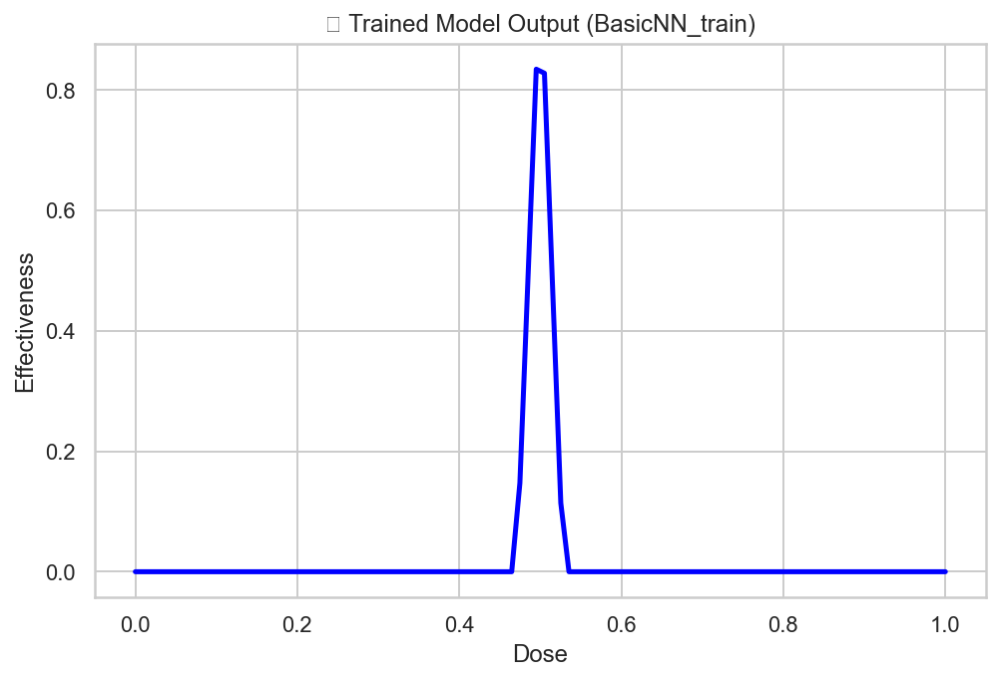

## 🧠 Simple Neural Network with PyTorch

A toy experiment using PyTorch to build and train a minimal neural network to model dose-effectiveness behavior. The goal is to visualize how a tiny neural network can learn to predict the most effective dose out of a range — using only one learnable parameter!



---

### 📌 About the Project

This project demonstrates how neural networks can learn a non-linear response curve using just basic PyTorch components. The use case simulates effectiveness peaking at a medium dose — much like what you'd expect in medicine or insurance-based risk calibration. It's built from scratch to offer full transparency and learning opportunity.

---

### 🛠️ How It Works

* The neural network has **fixed weights** except for one learnable parameter: `final_bias`.

* It’s trained to approximate an output curve like:

  * `input = 0.0 → output = 0.0`
  * `input = 0.5 → output = 1.0`
  * `input = 1.0 → output = 0.0`

* Optimized using **Stochastic Gradient Descent (SGD)**.

* The output is visualized using **Seaborn line plots**.

---

### 🧪 Output Example

> Trained model output curve (Dose vs Effectiveness):


---

### 📁 Files Included

| File             | Description                        |
| ---------------- | ---------------------------------- |
| `nn_train.py`    | Full training code for the network |
| `d2bcefdc...png` | Output plot showing trained curve  |
| `README.md`      | This file                          |

---

### 🚀 How to Run

1. Install requirements:

```bash
pip install torch matplotlib seaborn
```

2. Run the Python script:

```bash
python nn_train.py
```

---

### 🎯 Learnings

* How ReLU activations work
* How to build custom forward passes
* Visual feedback to understand neural behavior
* Foundation of deeper architectures

---

### 💡 Future Work

* Expand to more hidden layers and neurons
* Use real-world insurance or medical datasets
* Make all parameters learnable
* Evaluate with MSE loss metrics and convergence graphs

---
